# Pràctica: Sistema de control de versions (Git Flow)

## Introducció

En esta pràctica s'ha utilitzat **Git** junt amb el flux de treball **Git Flow** per gestionar un projecte col·laboratiu.
Encara que és una pràctica individual, s'han simulat 3 usuaris diferents (Usuari 1, Usuari 2, Usuari 3) amb commits diferenciats.

---

## Configuració inicial

* Creació del repositori a GitHub.
* Inicialització de `git flow` amb branques principals `main` i `develop`.
* Invitació al col·laborador obligatori **antoni-gimenez**.

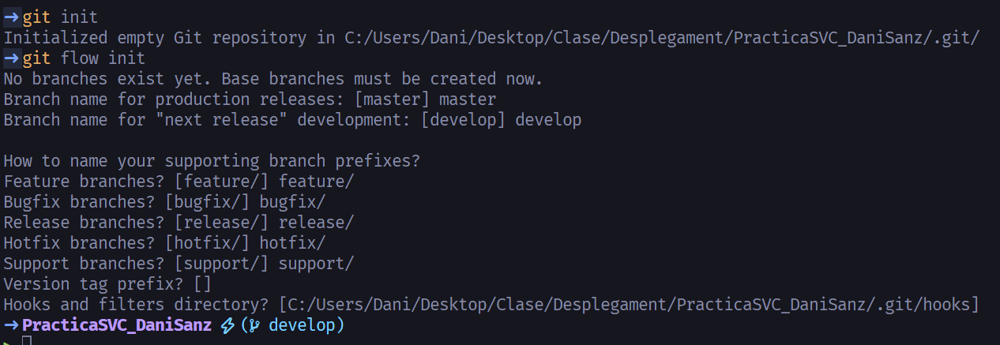

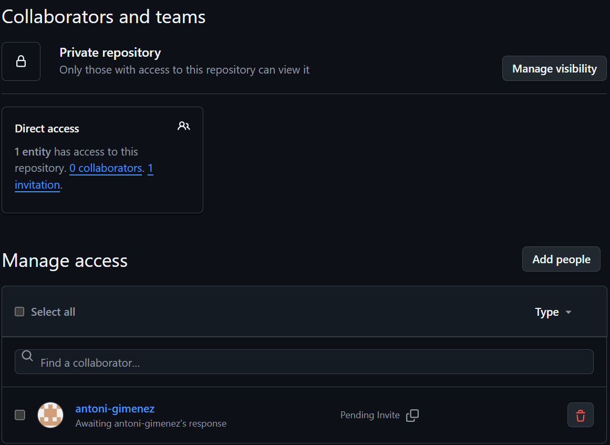

---

## Treball de l’Usuari 1

* Afegit l’estructura base: header, nav, home i footer.
* Commit inicial en la branca `develop`.

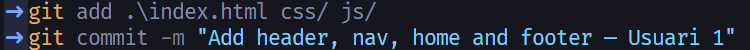

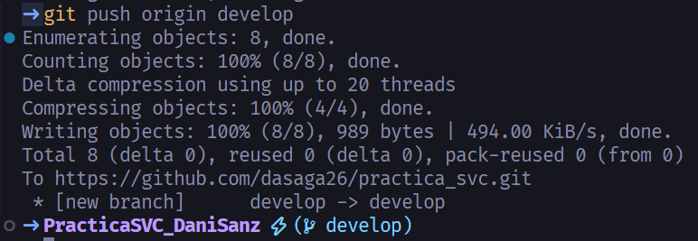

---

## Treball de l’Usuari 2

### Feature: contingut HTML

* Creació de la branca `feature/contingutHTML`.
* Exemple amb `innerHTML` i `styles.css`.
* Merge a `develop`.

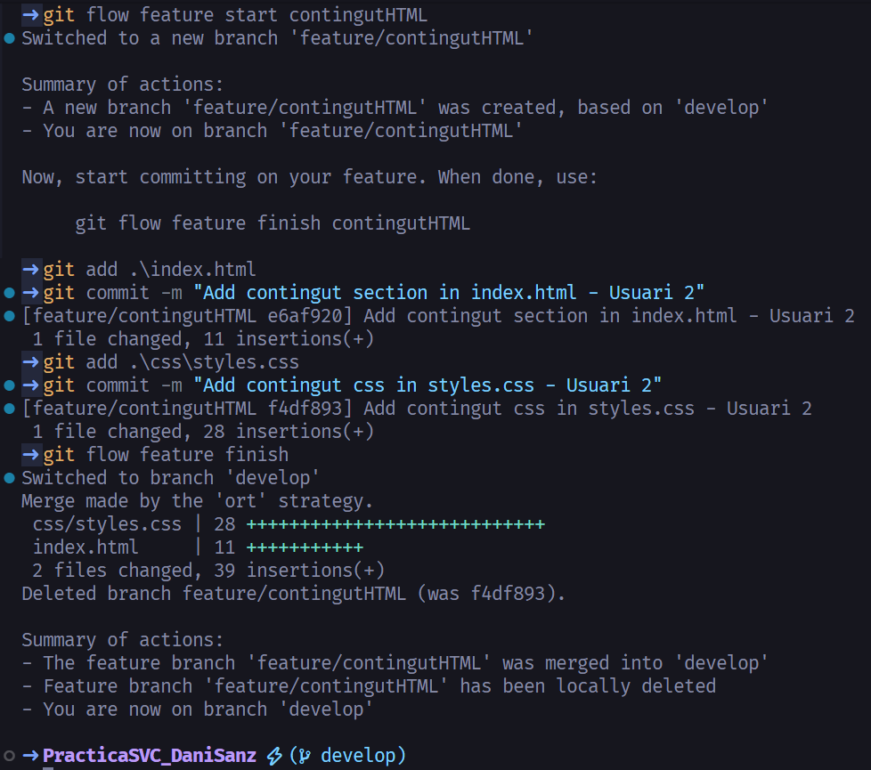

### Feature: atributs HTML

* Creació de la branca `feature/atributsHTML`.
* Exemple amb `setAttribute` i modificació de `script.js`.
* Merge a `develop`.

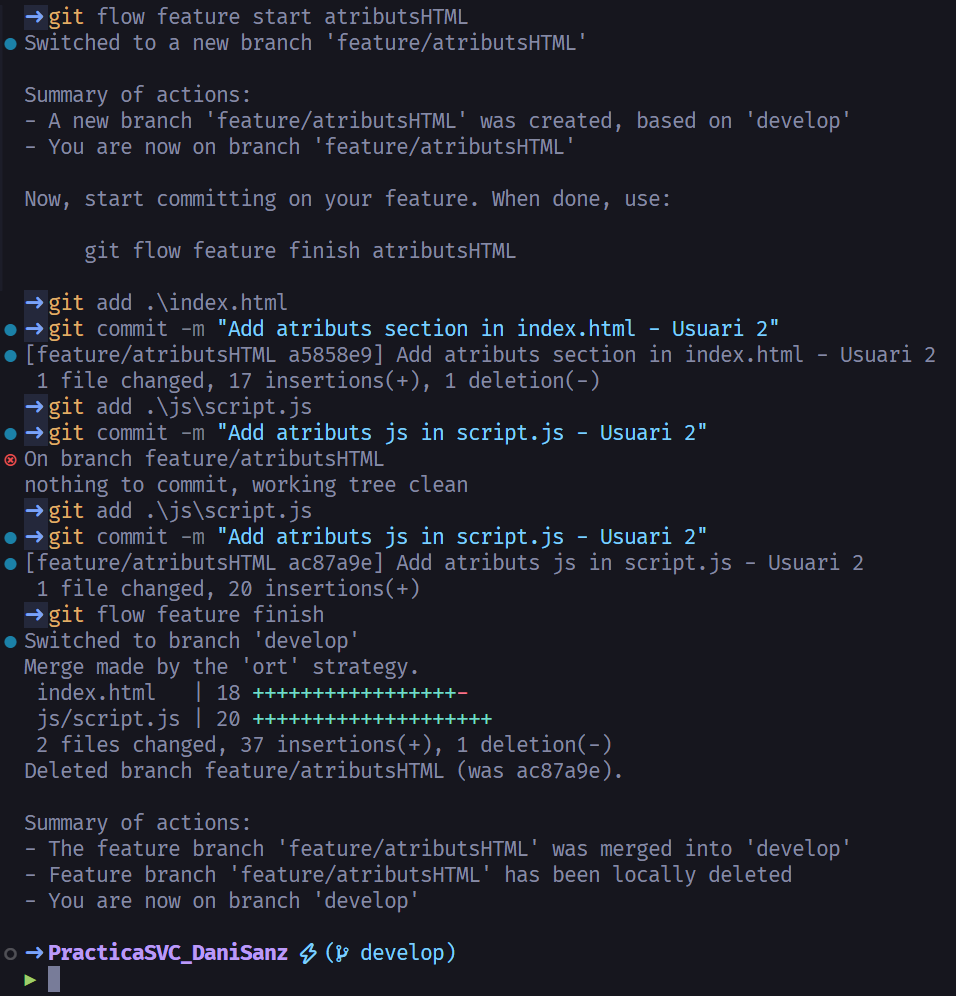

---

## Treball de l’Usuari 3

### Feature: estils CSS

* Creació de la branca `feature/estilsCSS`.
* Exemple de manipulació de classes amb `classList.toggle`.
* Merge a `develop`.

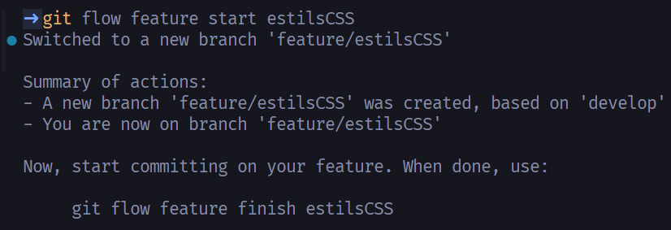

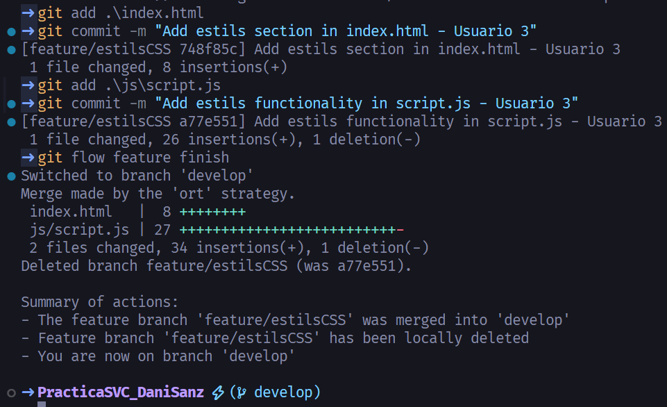

---

## Release v1.0

* Creació de la branca `release/1.0` amb `git flow`.
* Afegit `CHANGELOG.md`.
* Merge a `main` i `develop`.
* Creació de tag **v1.0**.

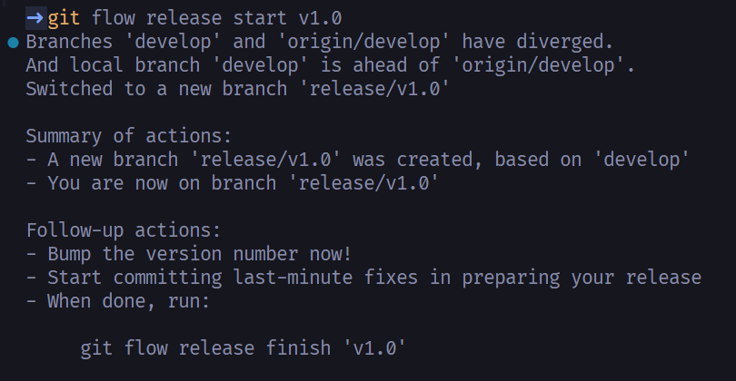

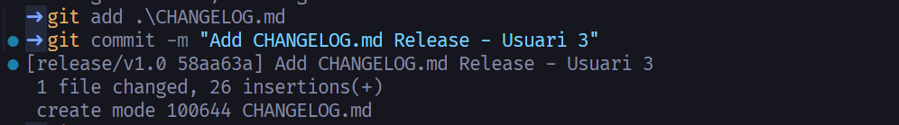

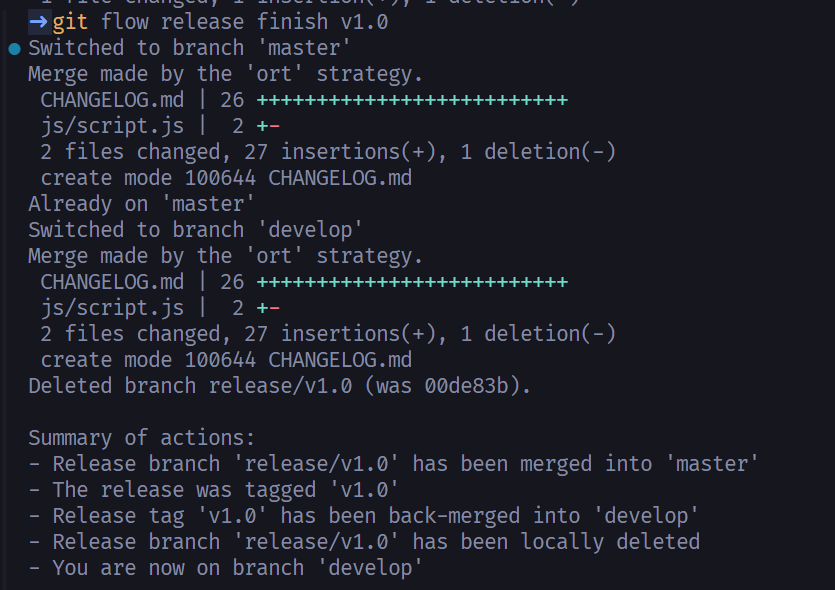

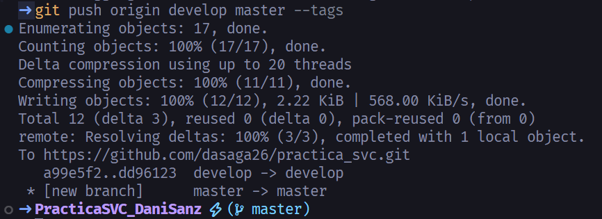

---

## Hotfix v1.0.1

* Creació de la branca `hotfix/milloresV_1_0`.
* Millora d’un exemple creat per l’Usuari 2.
* Merge a `main` i `develop`.
* Creació de tag **v1.0.1**.

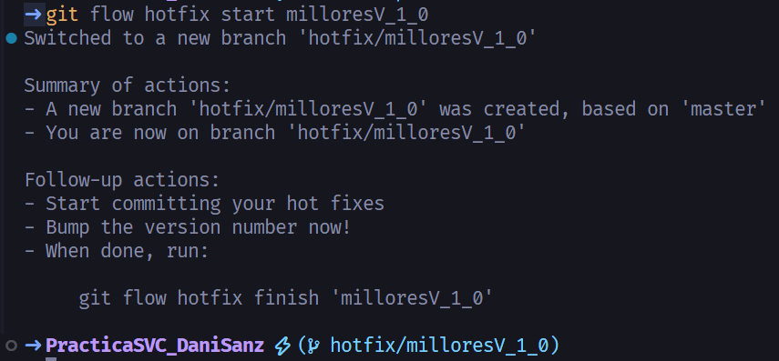

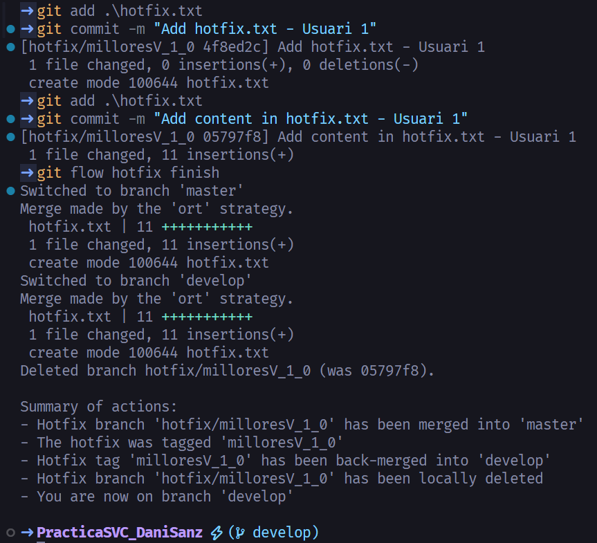

---

## Llistat de branques i tags

Per verificar l’estat final del repositori:

```bash
git branch -a
git tag -l
git log --graph --oneline --decorate --all
```

Aci hi ha una image de com quedaria el graph amb tots els commits, merge, rames, etc:

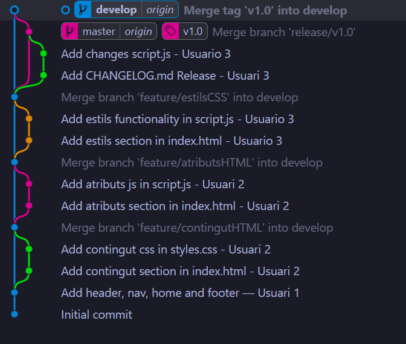

---

## Conclusió

La pàgina web conté totes les seccions desenvolupades pels tres usuaris simulats.
S’han aplicat correctament els passos de **Git Flow**: features → release → hotfix.
